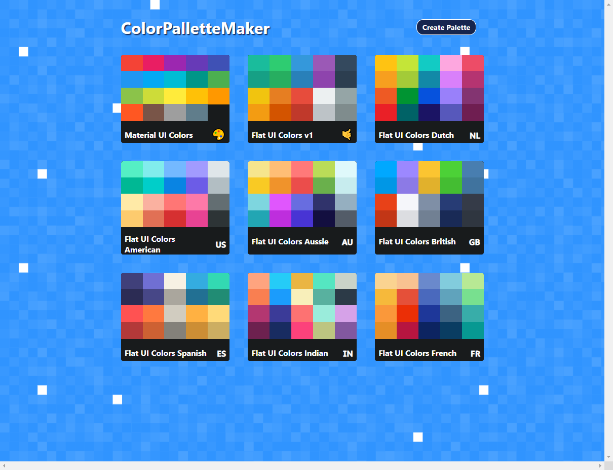
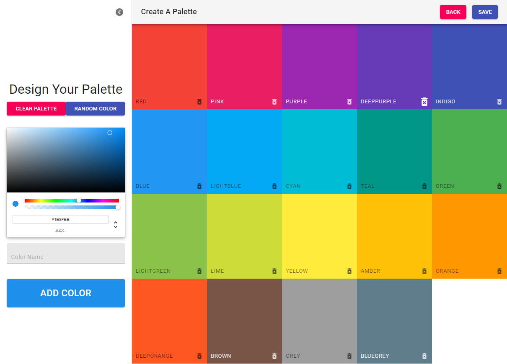
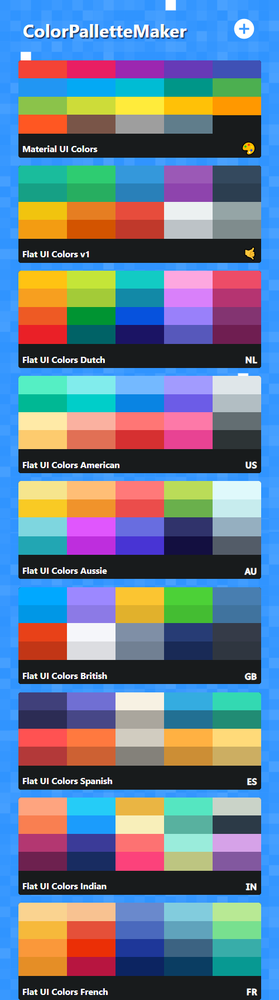
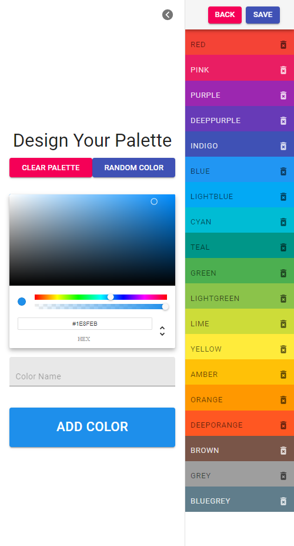

# Color Palette Maker

The color-picker to rule them all.

## Description

[Deployed Application]()

You can use this color palette application to create your own color palette to use in your projects. You can also choose from several existing themes included in the app! Soon, you'll be able to share your pallettes with the rest of the community and view public pallettes submitted by others. The best has yet to come, including the ability to save your pallettes securely in our database. Enjoy the preview and please provide feedback!

Note: This app was build with HTML, CSS, JSS, Javascript, and React.js.

[Link to video demo of app](https://drive.google.com/file/d/1hgFtjyYaF5Kyj0zcbL1m4hqeDo-E-y8L/view?usp=sharing)

## Table of Contents

- [Installation](#installation)
- [Usage](#usage)
- [Credits](#credits)
- [License](#license)
- [Features](#features)
- [Examples/Tests](#examples)

## Installation

- While this application is already hosted and running on Netlify, you can alternatively clone this repository down to your local machine.

## Usage

- To user the app, simply click the link to the deployed application at the top of the README.

- If you chose to clone down the repository, to install the app and run it locally, you will need to open up your command line at the root level of the repository.

- Next, you'll need to install the node packages necessary for this application by running "npm i"

- Finally, all you have to do is navigate to http://localhost:3000/ and use the Color Picker!

## Screenshots:

### Desktop:

### Mobile:

## Credits

Assets:

+ [React]()
+ [Node]()
+ [React Router]()
+ [MUI]()
+ [chroma-js]()
+ [emoji-mart]()
+ [react-transition-group]()

## Features

+ Users can choose from any of the 9 provided default color palettes
+ Users can create/update their own color palette using the color picking tool
+ Users can save color palettes and provide unique names to colors they choose
+ Users can personalize their palettes with a name and emoji
+ User data is stored in local storage

## License

+ MIT

## Ideas For Future Development

+ implement a backend that stores user pallettes in a MongoDB database instead of local storage

+ create a log-in and log-out feature 

+ allow users to store their own collections while being able to browse public pallettes submitted by other users

+ incorporate next.js

## How To Contribute

+ Have additional ideas for improving this site? Please first discuss the change you wish to make via email with the owner of this repository. Email address can be found on the author's gitHub page.
